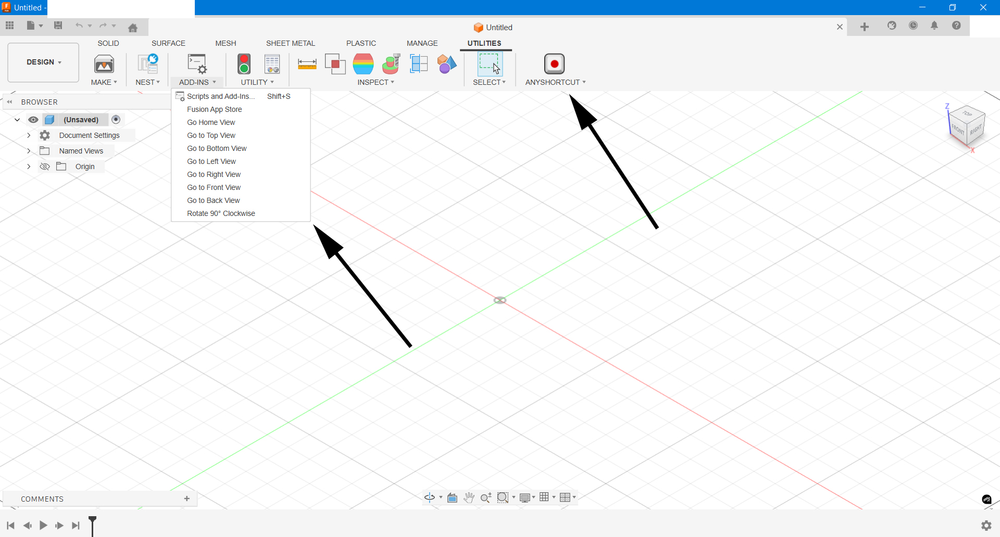

# Fusion ViewDeck

Fusion ViewDeck adds a dropdown menu in Autodesk Fusion 360 for instantly jumping to:

- Home
- Top
- Bottom
- Left
- Right
- Front
- Back
- Rotating any view 90°

Each command can be individually bound to shortcut keys using the AnyShortcut add-in:

https://apps.autodesk.com/FUSION/en/Detail/Index?id=156700835167123223

------------------------------------------------------------
Example Shortcut Bindings:
------------------------------------------------------------
  H -> Home View
  F -> Front View
  T -> Top View
  R -> Rotate 90 Degrees (if included)

------------------------------------------------------------
Installation Instructions (Windows):
------------------------------------------------------------

1. Create a new folder called `viewdeck` and copy these two files into it:
   - viewdeck.py 
   - manifest.json

2. Move that folder to:

   %appdata%\Autodesk\Autodesk Fusion 360\API\AddIns\viewdeck

   Full path:
   C:\Users\your_user_name\AppData\Roaming\Autodesk\Autodesk Fusion 360\API\AddIns\viewdeck

3. In Fusion 360:
   - Go to the "Utilities" tab
   - Open "Add-Ins"
   - Click the plus sign (+) to add a script or add-in from device
   - Select the folder you just created

------------------------------------------------------------
What You'll See:
------------------------------------------------------------

You’ll get a new dropdown menu in your toolbar that looks like this:

Each item in the dropdown can be individually assigned a shortcut key using the AnyShortcut add-in.

------------------------------------------------------------
